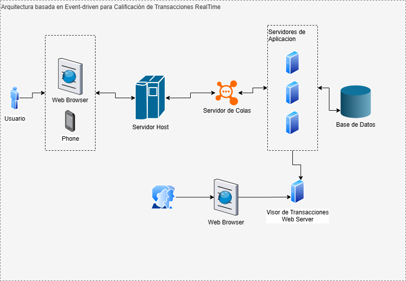

# ADR 0001 - Arquitectura basada en Event-driven para Calificación de Transacciones RealTime

**Estado:** Propuesta  
**Fecha:** 2026-03-24  
**Decisor:** Jhonattan Saldaña (Arquitecto de Soluciones Senior)

## Contexto y problema
Se requiere un sistema de calificación de transacciones en tiempo real que soporte al menos 4 usuarios concurrentes, con latencia menor a 200 ms y alta disponibilidad. El procesamiento debe ser asíncrono para no bloquear la experiencia del usuario.

## Decisión
Se adopta una **arquitectura basada en eventos (Event-driven)** utilizando un servidor de colas central. Los eventos de transacciones se encolan y son procesados por múltiples servidores de aplicación de forma paralela.

## Diagrama de arquitectura

## Alternativas consideradas
- **Opción 1: Servicio de mensajería administrado** (ej. AWS SQS, RabbitMQ Cloud)  
  Muy escalable, pero genera costo mensual y requiere equipo de DevOps.

## Consecuencias
**Positivas:**
- Costo cero adicional en infraestructura de colas.
- Latencia muy baja (los servidores de aplicación leen constantemente de la cola).
- Fácil de implementar con tecnología actual.

**Negativas / Riesgos:**
- Si el volumen crece a miles de usuarios concurrentes, los servidores de aplicación y la base de datos pueden saturarse.
- Se requiere monitoreo proactivo de colas y servidores.

**Referencias:**
- Diagrama original en draw.io: [enlace al archivo .drawio en GitHub](https://github.com/jhonattan/system-design-adr/tree/main/mi-arquitectura/diagrams/arquitectura-general.drawio)
- System Design Interview – Alex Xu (Vol. 1 y 2)
